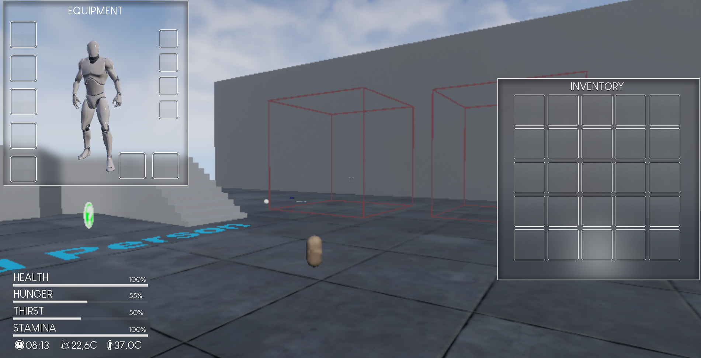

# Jeu de Survie avec Blueprints

Bienvenue dans le répertoire de mon cours Unreal Engine Blueprint sur la création d’un jeu de survie ! Ce projet présente diverses mécaniques de survie et systèmes dynamiques développés avec Unreal Engine 4.27. Vous trouverez ci-dessous une description détaillée des fonctionnalités implémentées et des instructions de configuration.



---

## Fonctionnalités

### Mécaniques de Survie
- **Système de Besoins Complexe** : Gérez la faim, la soif, la santé et l’endurance.
- **Inventaire et Équipement** : Comprend des objets empilables et des emplacements d’équipement.
- **Effets Dynamiques des Objets** : Objets permettant de restaurer les besoins ou d’améliorer la résistance aux facteurs extérieurs.
- **Gestion de la Température** :
  - Température corporelle influencée par la température ambiante.
  - Mécaniques d’hypothermie et d’hyperthermie.

### Systèmes Environnementaux
- **Cycle Jour/Nuit** :
  - Contrôle complet des heures de lever et de coucher du soleil.
  - Mise à jour dynamique de l’éclairage environnemental.
- **Météo Dynamique** :
  - Deux émetteurs de particules : pluie et neige.
  - Effets tels que l’accumulation de neige sur les objets et les surfaces mouillées.
- **Zones Climatiques** :
  - Trois biomes distincts : désert, tempéré et enneigé.

### Interface Utilisateur (HUD)
- **Minimaliste et Dynamique** :
  - Affiche les statistiques essentielles (température, besoins, heure).
  - Alertes colorées pour les états critiques.

---

## Prérequis
- **Unreal Engine 4.27** : Cette version est nécessaire pour éviter les problèmes de compatibilité. Les autres versions, en particulier la 4.19 et ultérieures, peuvent rencontrer des erreurs.
- **Bases Solides d'Unreal Engine** : Une bonne connaissance des Blueprints et de la navigation dans le moteur est requise.

---

## Instructions de Configuration
1. Clonez le répertoire :
   ```bash
   git clone https://github.com/VotreNomUtilisateur/JeuSurvieBlueprint.git
   ```
2. Ouvrez Unreal Engine 4.27 et naviguez jusqu’au dossier du projet.
3. Lancez le fichier `.uproject` pour ouvrir le projet.
4. Suivez la structure du cours pour explorer et développer les fonctionnalités.

---

## Objectifs d'Apprentissage
À la fin de ce cours, vous saurez :
- Créer un système de besoins complexe et dynamique.
- Gérer un inventaire et un équipement dans Blueprints.
- Développer un cycle jour/nuit et une gestion de la température globale.
- Implémenter des systèmes météo dynamiques avec des effets de particules.
- Concevoir une interface utilisateur minimaliste et intuitive.
- Construire des biomes variés avec des conditions environnementales uniques.

---

## Crédits
- Ce projet est basé sur un cours Blueprint conçu pour enseigner les mécaniques des jeux de survie dans Unreal Engine.

---

## Licence
Ce projet est destiné à des fins éducatives uniquement. Veuillez vous référer aux conditions de l’instructeur pour toute utilisation commerciale.

---

